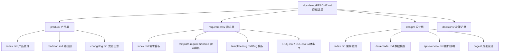
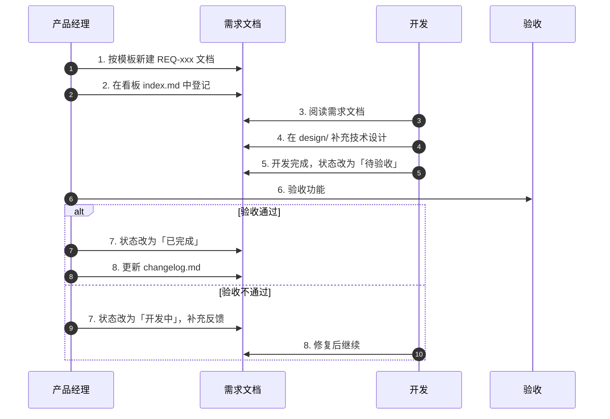

# [项目名称] 文档中心

欢迎来到 [项目名称] 的文档中心！这里记录产品的全部信息：需求、设计、进度、变更。

> 如果你是产品经理，不懂代码也没关系，重点看 **product/** 和 **requirements/** 两个目录即可。

---

## 文档地图

---

## 各目录说明

### product/ —— 产品层（产品经理主导）

| 文件 | 用途 |
|---|---|
| `product/index.md` | 产品愿景、核心功能全景图、用户能做什么 |
| `product/roadmap.md` | 产品路线图，已上线 / 开发中 / 规划中 |
| `product/changelog.md` | 每次迭代的变更记录，按版本归档 |

### requirements/ —— 需求层（产品经理在这里提需求）

| 文件 | 用途 |
|---|---|
| `requirements/index.md` | **需求看板**，所有需求的状态一目了然 |
| `requirements/template-requirement.md` | **需求模板**，复制这个文件来提新需求 |
| `requirements/template-bug.md` | **Bug 模板**，复制这个文件来提 Bug |
| `requirements/example-REQ-001.md` | 一个已填好的需求示例，供参考 |
| `requirements/REQ-xxx-需求名称.md` | 每个需求一个独立文件 |
| `requirements/BUG-xxx-问题描述.md` | 每个 Bug 一个独立文件 |

**提需求步骤**：
1. 复制 `requirements/template-requirement.md`
2. 重命名为 `REQ-003-你的需求名称.md`（编号顺延）
3. 按模板填写内容
4. 在 `requirements/index.md` 里登记这条新需求

### design/ —— 设计层（开发承接需求后输出）

| 文件 | 用途 |
|---|---|
| `design/index.md` | 系统架构图、前后端交互说明 |
| `design/data-model.md` | 数据库设计、表结构关系 |
| `design/api-overview.md` | API 接口列表、调用链路 |
| `design/pages/` | 每个页面的交互与逻辑设计 |

产品经理可以查看这一层来了解功能是怎么实现的，但不需要自己写。

### decisions/ —— 决策记录

| 文件 | 用途 |
|---|---|
| `decisions/index.md` | 记录重要的技术与产品决策（如：为什么用某数据库？为什么选某框架？） |

---

## 需求生命周期（产品经理 ↔ 开发协作流程）

---

## 快速导航

- [产品总览](product/index.md)
- [需求看板](requirements/index.md)
- [系统架构](design/index.md)
- [变更日志](product/changelog.md)
- [决策记录](decisions/index.md)

---

## 使用提示

1. 本目录是**通用文档骨架**，使用时请把 `[项目名称]`、`[模块名称]` 等占位符替换为实际内容。
2. 编号规则：需求从 `REQ-001` 开始顺序递增；Bug 从 `BUG-001` 开始；决策从 `ADR-001` 开始。
3. 每个 `.md` 文件底部都应保留 `## 相关文档` 区块，方便在文档间跳转。
