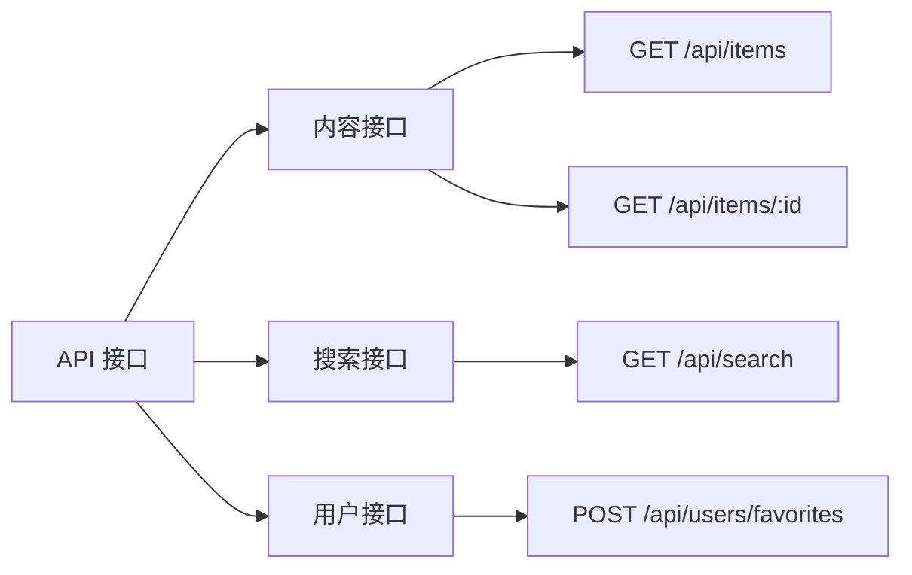
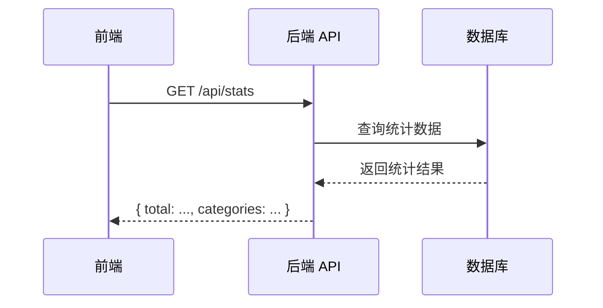
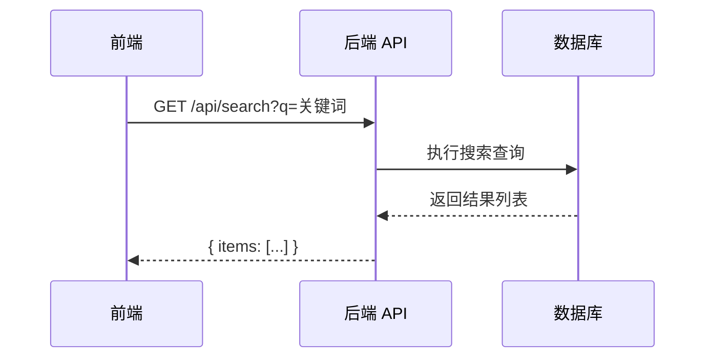

# [项目名称] API 接口说明

本文档列出 [项目名称] 提供的 API 接口、调用方式及示例。

---

## 接口分组图



---

## 接口详情

### 内容接口

| 方法 | 路径 | 说明 | 主要参数 |
|---|---|---|---|
| GET | `/api/items` | 获取内容列表 | `page`, `pageSize` |
| GET | `/api/items/:id` | 获取内容详情 | `id`（路径参数） |

### 搜索接口

| 方法 | 路径 | 说明 | 主要参数 |
|---|---|---|---|
| GET | `/api/search` | 关键词搜索 | `q`（关键词） |

### 用户接口

| 方法 | 路径 | 说明 | 主要参数 |
|---|---|---|---|
| POST | `/api/users/favorites` | 添加收藏 | `item_id` |

---

## 调用链路示例

### 场景一：浏览首页



### 场景二：搜索内容



---

## 响应格式

### 成功响应示例

```json
{
  "code": 0,
  "data": {
    "items": [],
    "total": 0
  },
  "message": "success"
}
```

### 错误响应示例

```json
{
  "code": 1001,
  "data": null,
  "message": "参数错误"
}
```

---

## 相关文档

- [设计总览](index.md)
- [数据模型](data-model.md)
- [页面设计](pages/index.md)
