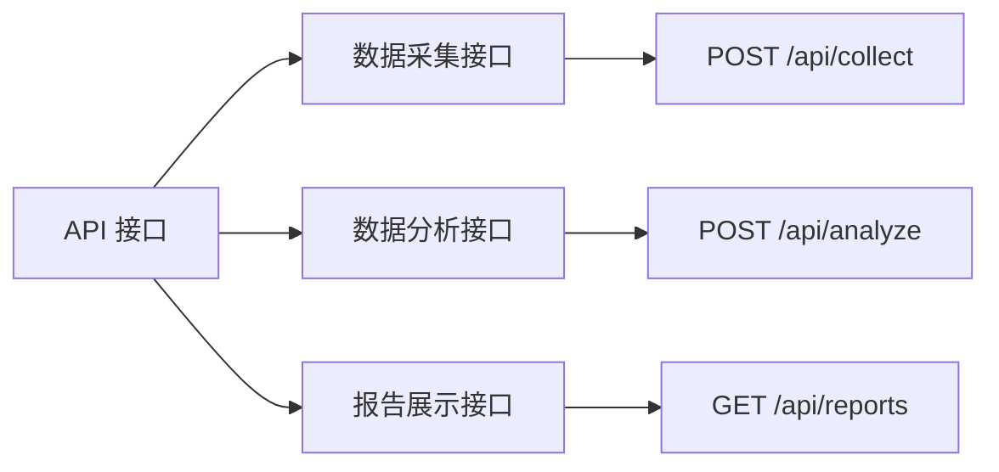
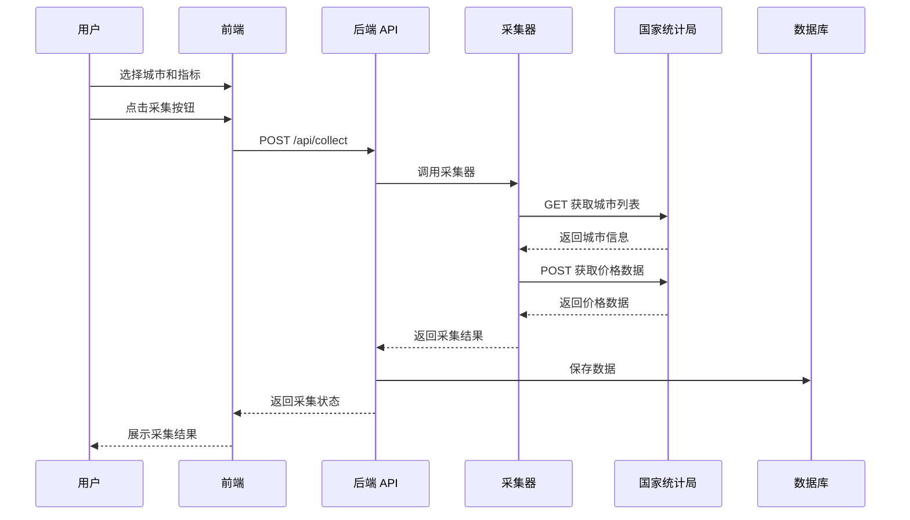
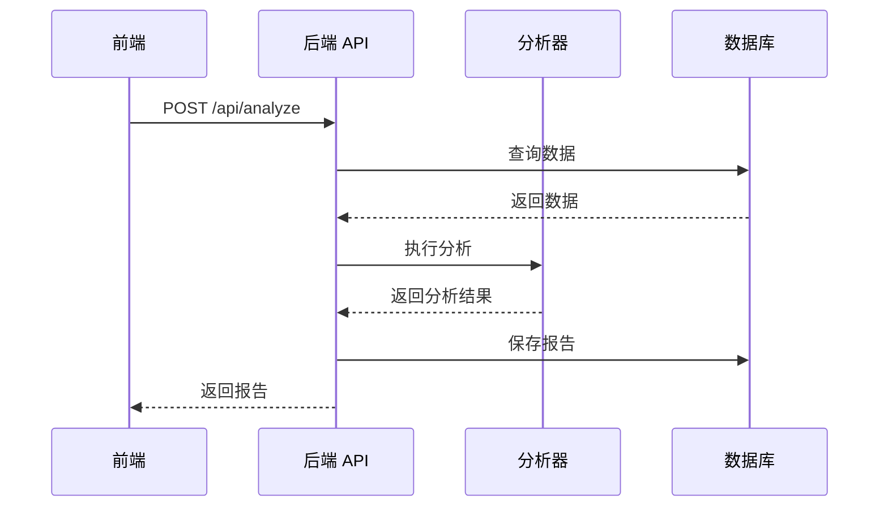

# 屋檐 API 接口说明

本文档列出屋檐项目提供的 API 接口、调用方式及示例，以及外部数据源接口信息。

---

## 接口分组图



---

## 内部 API 接口详情

### 数据采集接口

| 方法 | 路径 | 说明 | 主要参数 |
|---|---|---|---|
| POST | `/api/collect` | 触发数据采集 | `city_name`, `indicator_name`, `start_period`, `end_period` |
| GET | `/api/cities` | 获取支持的城市列表 | 无 |
| GET | `/api/indicators` | 获取支持的指标列表 | 无 |

### 数据分析接口

| 方法 | 路径 | 说明 | 主要参数 |
|---|---|---|---|
| POST | `/api/analyze` | 分析数据并生成报告 | `city_name`, `indicator_name`, `start_period`, `end_period` |
| GET | `/api/data` | 获取原始数据 | `city_name`, `indicator_name`, `start_period`, `end_period` |

### 报告展示接口

| 方法 | 路径 | 说明 | 主要参数 |
|---|---|---|---|
| GET | `/api/reports` | 获取报告列表 | `city_name`, `indicator_name`（可选） |
| GET | `/api/reports/:id` | 获取报告详情 | `id`（路径参数） |

---

## 外部数据源接口

### 国家统计局 - 70个大中城市住宅销售价格

#### 接口1：获取城市列表

| 属性 | 值 |
|---|---|
| **接口地址** | `https://data.stats.gov.cn/dg/website/publicrelease/web/external/getDasByDaCatalogId` |
| **请求方法** | GET |
| **说明** | 获取 70 个大中城市的名称和编号信息 |

**请求参数：**

| 参数名 | 类型 | 必填 | 说明 |
|---|---|---|---|
| `daCid` | string | 是 | 数据目录ID，固定值：`44016f1bffeb4ea49fe34e100c6415fb` |

**示例请求：**
```
GET https://data.stats.gov.cn/dg/website/publicrelease/web/external/getDasByDaCatalogId?daCid=44016f1bffeb4ea49fe34e100c6415fb
```

---

#### 接口2：获取城市住宅销售价格数据

| 属性 | 值 |
|---|---|
| **接口地址** | `https://data.stats.gov.cn/dg/website/publicrelease/web/external/stream/esData` |
| **请求方法** | POST |
| **说明** | 获取指定城市最近一段时间的住宅销售价格数据 |

**请求体（Body）：**

```json
{
    "cid": "3eb43764c74741469b745c396cf002d1",
    "indicatorIds": [
        "9445413888804ca8aa533b7ef859103b",
        "accb0def73524078a2f9517e6e39c628",
        "b536b34ad00c46c0832e0fb5e09ba686",
        "732f9cca00c84facb9bb8dd8365bc0e7",
        "fb43046325f64e3896a96b70b071d52b",
        "b61c4ef46f5a4d03a02b06d90fcf0980",
        "2e903b90641f453196dada70699f4e69",
        "05dd255eb4d54986a567d523b4403676",
        "11ad09962ea7497eb2ccdf2be5719a20",
        "97d66103d9524635b6aea7f136ac70c3",
        "3a6d0fb67cb74c148d371993672d26cd",
        "25205b9fb3054cc89ff1d1e0fc4bc110",
        "2624e01a782d4f47a23610bd056570ae",
        "6bf41d9c10ef495bb6369e82e824c218",
        "ab1186501035483fae81dc2d8c882e17",
        "73a8b0fe738a482491ed17e9b28e0d85",
        "cbcf12312fec43768ead1af77fd26ed0",
        "9314a623544b4d20ad27be3f962deebf",
        "d4850e3f460b4f1c84d71cf0a8900a0f",
        "93815f78b2d54fc98a34b9669be5467f",
        "757f2c9afc39420d89c47c30890d9de5",
        "18c087a18dc145e7b0501d1fc05959cb",
        "9f75757cb7d9438fbd11cccf89613028",
        "98fb96672e1c4666adb821e393499b46",
        "e9a41436e75841bc95eaadb21ab1f02e",
        "d5f4c9e221eb49bea23b5d1ca125f1f8",
        "20a5ed14619847f6b8638f942cdca4e6",
        "45871773323240bb91dddbfa5e2a1b55",
        "0a73708bfa9e45798883a9b186b7f703",
        "bf5eb59fa096441ea78f71073e0a288e",
        "af76711644c24b468fa8cb382b73da22",
        "3b970e6f7834459b909a2a9203242c2e",
        "dae265212c9f4e48bbbd9038362f628e",
        "a82be5ebd70945eeadbd0eec4ee4225c",
        "61aace5a8919489db2c22ab9e55050b9"
    ],
    "daCatalogId": "",
    "das": [
        {
            "text": "北京",
            "value": "110000000000"
        }
    ],
    "showType": "1",
    "dts": [
        "202506MM-202605MM"
    ],
    "rootId": "327ecbb2e6b14c669da1e99e39faa24c"
}
```

**字段说明：**

| 字段 | 类型 | 说明 |
|---|---|---|
| `cid` | string | 分类ID |
| `indicatorIds` | string[] | 指标ID列表（35个指标） |
| `daCatalogId` | string | 数据目录ID（当前为空） |
| `das` | array | 城市列表，包含 `text`（城市名）和 `value`（城市编码） |
| `showType` | string | 展示类型，固定值 `1` |
| `dts` | string[] | 时间范围，格式 `YYYYMM-YYYYMM` |
| `rootId` | string | 根节点ID |

---

## 调用链路示例

### 场景一：采集国家统计局数据



### 场景二：生成分析报告



---

## 响应格式

### 成功响应示例

```json
{
  "code": 0,
  "data": {
    "items": [],
    "total": 0
  },
  "message": "success"
}
```

### 错误响应示例

```json
{
  "code": 1001,
  "data": null,
  "message": "参数错误"
}
```

---

## 相关文档

- [设计总览](index.md)
- [数据模型](data-model.md)
- [页面设计](pages/index.md)
- [国家统计局数据源](https://data.stats.gov.cn)
