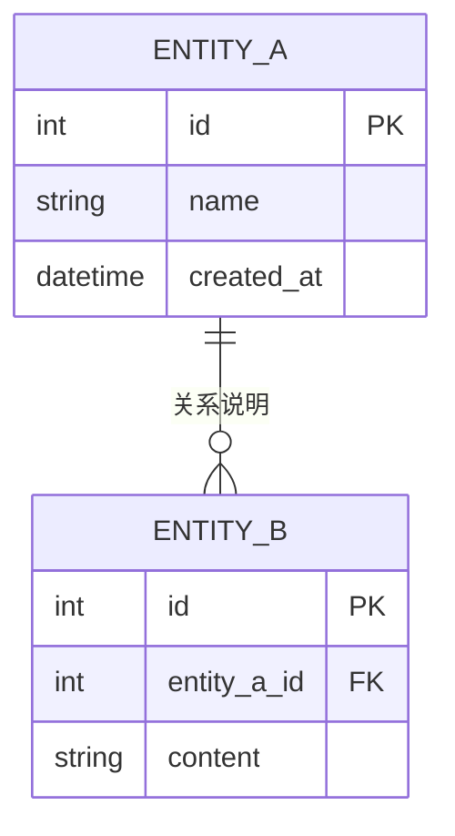

# [项目名称] 数据模型设计

本文档描述 [项目名称] 的核心数据模型、表结构以及数据流转。

---

## ER 图

---

## 表结构说明

### 表 A：[表 A 名称]

| 字段名 | 类型 | 说明 |
|---|---|---|
| id | INTEGER PK | 主键，自增 |
| name | TEXT | 名称 |
| created_at | DATETIME | 创建时间 |

### 表 B：[表 B 名称]

| 字段名 | 类型 | 说明 |
|---|---|---|
| id | INTEGER PK | 主键，自增 |
| entity_a_id | INTEGER FK | 关联表 A 的 ID |
| content | TEXT | 内容 |

---

## 数据流转

---

## 数据统计

| 数据项 | 数量 | 说明 |
|---|---|---|
| [数据项 A] | [数量] | [说明] |
| [数据项 B] | [数量] | [说明] |

---

## 相关文档

- [设计总览](index.md)
- [API 接口说明](api-overview.md)
- [页面设计](pages/index.md)
