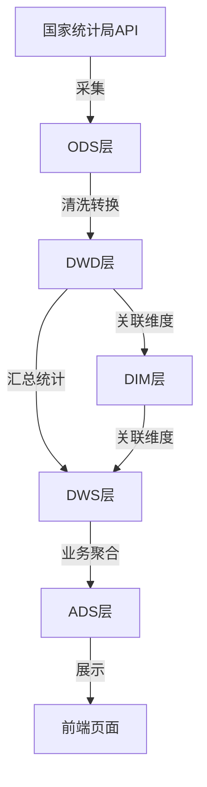
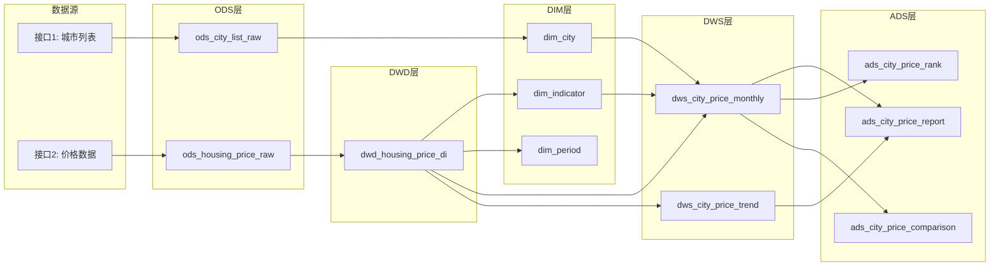

# 屋檐 数据仓库模型设计

本文档按数据仓库规范设计屋檐项目的数据模型，分为 ODS、DWD、DIM、DWS、ADS 五层。

---

## 数据分层架构

| 层级 | 名称 | 说明 |
|---|---|---|
| ODS | 操作数据存储层 | 原始数据接入，保持原貌 |
| DWD | 明细数据层 | 数据清洗、标准化、轻度汇总 |
| DIM | 维度层 | 城市、指标、时间等维度表 |
| DWS | 汇总数据层 | 按维度汇总统计 |
| ADS | 应用数据层 | 面向业务场景的数据产品 |

---

## ODS 层 - 原始数据存储

### ods_housing_price_raw（住宅销售价格原始数据）

存储接口2返回的原始JSON数据，保持原貌便于追溯。

| 字段名 | 类型 | 说明 |
|---|---|---|
| id | INTEGER PK | 自增主键 |
| raw_json | TEXT | 原始JSON完整数据 |
| request_params | TEXT | 请求参数JSON |
| api_url | TEXT | 请求接口地址 |
| response_code | INTEGER | HTTP状态码 |
| city_code | TEXT | 城市编码 |
| period_range | TEXT | 查询时间范围 |
| etl_time | DATETIME | 数据采集时间 |
| data_source | TEXT | 数据来源标识 |

### ods_city_list_raw（城市列表原始数据）

存储接口1返回的原始城市列表数据。

| 字段名 | 类型 | 说明 |
|---|---|---|
| id | INTEGER PK | 自增主键 |
| raw_json | TEXT | 原始JSON完整数据 |
| api_url | TEXT | 请求接口地址 |
| response_code | INTEGER | HTTP状态码 |
| etl_time | DATETIME | 数据采集时间 |
| data_source | TEXT | 数据来源标识 |

---

## DWD 层 - 明细数据层

### dwd_housing_price_di（住宅销售价格明细表）

从ODS层清洗后的标准明细数据，每日增量。

| 字段名 | 类型 | 说明 |
|---|---|---|
| id | INTEGER PK | 自增主键 |
| city_code | TEXT | 城市编码（如110000000000） |
| city_name | TEXT | 城市名称（如北京市） |
| indicator_id | TEXT | 指标ID（如732f9cca00c84facb9bb8dd8365bc0e7） |
| indicator_name | TEXT | 指标名称（如新建商品住宅销售价格指数） |
| indicator_base | TEXT | 指标基期（如上月=100、上年同月=100） |
| period_code | TEXT | 数据期间编码（如202605MM） |
| period_name | TEXT | 数据期间名称（如2026年5月） |
| value | REAL | 数值 |
| unit | TEXT | 单位（如无、%） |
| data_type | TEXT | 数据类型（indicator） |
| catalog_id | TEXT | 分类目录ID |
| etl_time | DATETIME | 数据清洗时间 |
| data_source | TEXT | 数据来源 |

**数据清洗规则：**
- 空值（""）转换为 NULL
- 城市名称统一格式（去除"市"后缀可选）
- 数值字段类型转换
- 时间格式统一标准化

---

## DIM 层 - 维度层

### dim_city（城市维度表）

| 字段名 | 类型 | 说明 |
|---|---|---|
| city_code | TEXT PK | 城市编码 |
| city_name | TEXT | 城市名称 |
| city_full_name | TEXT | 城市全称 |
| province_code | TEXT | 省份编码 |
| province_name | TEXT | 省份名称 |
| region | TEXT | 区域（华东/华北/华南等） |
| tier | TEXT | 城市等级（一线/二线/三线） |
| is_active | INTEGER | 是否有效（1=有效，0=无效） |
| create_time | DATETIME | 创建时间 |
| update_time | DATETIME | 更新时间 |

### dim_indicator（指标维度表）

| 字段名 | 类型 | 说明 |
|---|---|---|
| indicator_id | TEXT PK | 指标ID |
| indicator_name | TEXT | 指标名称 |
| indicator_category | TEXT | 指标分类（新建住宅/二手住宅/商品住宅） |
| indicator_type | TEXT | 指标类型（价格指数/面积/金额） |
| base_period | TEXT | 基期类型（上月=100/上年同月=100/上年同期=100/当期基期年=100） |
| unit | TEXT | 单位 |
| catalog_id | TEXT | 所属分类ID |
| sort_order | INTEGER | 排序号 |
| is_active | INTEGER | 是否有效 |
| create_time | DATETIME | 创建时间 |
| update_time | DATETIME | 更新时间 |

### dim_period（时间维度表）

| 字段名 | 类型 | 说明 |
|---|---|---|
| period_code | TEXT PK | 期间编码（如202605MM） |
| period_name | TEXT | 期间名称（如2026年5月） |
| year | INTEGER | 年份 |
| month | INTEGER | 月份 |
| quarter | INTEGER | 季度 |
| year_month | TEXT | 年月（YYYY-MM） |
| is_current_month | INTEGER | 是否当前月 |
| is_active | INTEGER | 是否有效 |
| create_time | DATETIME | 创建时间 |

---

## DWS 层 - 汇总数据层

### dws_city_price_monthly（城市房价月度汇总）

按城市和月份汇总的房价指标数据。

| 字段名 | 类型 | 说明 |
|---|---|---|
| id | INTEGER PK | 自增主键 |
| city_code | TEXT | 城市编码 |
| city_name | TEXT | 城市名称 |
| period_code | TEXT | 期间编码 |
| year | INTEGER | 年份 |
| month | INTEGER | 月份 |
| new_house_mom | REAL | 新建商品住宅环比（上月=100） |
| new_house_yoy | REAL | 新建商品住宅同比（上年同月=100） |
| new_house_ytd | REAL | 新建商品住宅累计同比（上年同期=100） |
| new_house_base | REAL | 新建商品住宅定基（当期基期年=100） |
| second_hand_mom | REAL | 二手住宅环比（上月=100） |
| second_hand_yoy | REAL | 二手住宅同比（上年同月=100） |
| second_hand_ytd | REAL | 二手住宅累计同比（上年同期=100） |
| second_hand_base | REAL | 二手住宅定基（当期基期年=100） |
| etl_time | DATETIME | 汇总计算时间 |

### dws_city_price_trend（城市房价趋势汇总）

计算各城市的房价趋势特征。

| 字段名 | 类型 | 说明 |
|---|---|---|
| id | INTEGER PK | 自增主键 |
| city_code | TEXT | 城市编码 |
| city_name | TEXT | 城市名称 |
| latest_period | TEXT | 最新数据期间 |
| latest_new_house_mom | REAL | 最新新建商品住宅环比 |
| latest_new_house_yoy | REAL | 最新新建商品住宅同比 |
| trend_3m | TEXT | 近3月趋势（上升/下降/平稳） |
| trend_6m | TEXT | 近6月趋势 |
| trend_12m | TEXT | 近12月趋势 |
| max_yoy_period | TEXT | 同比最高值期间 |
| max_yoy_value | REAL | 同比最高值 |
| min_yoy_period | TEXT | 同比最低值期间 |
| min_yoy_value | REAL | 同比最低值 |
| etl_time | DATETIME | 计算时间 |

---

## ADS 层 - 应用数据层

### ads_city_price_report（城市房价分析报告）

面向报告生成的应用数据表。

| 字段名 | 类型 | 说明 |
|---|---|---|
| id | INTEGER PK | 自增主键 |
| report_id | TEXT | 报告唯一标识 |
| city_code | TEXT | 城市编码 |
| city_name | TEXT | 城市名称 |
| report_title | TEXT | 报告标题 |
| report_period | TEXT | 报告数据期间 |
| summary_text | TEXT | 分析摘要 |
| mom_analysis | TEXT | 环比分析 |
| yoy_analysis | TEXT | 同比分析 |
| trend_analysis | TEXT | 趋势分析 |
| chart_data_json | TEXT | 图表数据JSON |
| report_status | TEXT | 报告状态（draft/published） |
| create_time | DATETIME | 创建时间 |
| update_time | DATETIME | 更新时间 |

### ads_city_price_rank（城市房价排名）

面向排名展示的应用数据。

| 字段名 | 类型 | 说明 |
|---|---|---|
| id | INTEGER PK | 自增主键 |
| rank_period | TEXT | 排名期间 |
| rank_type | TEXT | 排名类型（环比/同比/定基） |
| rank_scope | TEXT | 排名范围（全部/一线/二线） |
| city_code | TEXT | 城市编码 |
| city_name | TEXT | 城市名称 |
| rank_num | INTEGER | 排名名次 |
| indicator_value | REAL | 指标值 |
| change_pct | REAL | 变化幅度 |
| change_direction | TEXT | 变化方向（上升/下降/持平） |
| create_time | DATETIME | 创建时间 |

### ads_city_price_comparison（城市对比数据）

面向城市对比分析的应用数据。

| 字段名 | 类型 | 说明 |
|---|---|---|
| id | INTEGER PK | 自增主键 |
| comparison_id | TEXT | 对比组ID |
| period_code | TEXT | 期间编码 |
| city_a_code | TEXT | 城市A编码 |
| city_a_name | TEXT | 城市A名称 |
| city_b_code | TEXT | 城市B编码 |
| city_b_name | TEXT | 城市B名称 |
| indicator_type | TEXT | 指标类型 |
| city_a_value | REAL | 城市A数值 |
| city_b_value | REAL | 城市B数值 |
| diff_value | REAL | 差值 |
| diff_pct | REAL | 差值百分比 |
| winner_city | TEXT | 较高值城市 |
| create_time | DATETIME | 创建时间 |

---

## 数据流转图

---

## ETL 流程说明

### ODS -> DWD

- 解析原始JSON数据
- 提取城市、指标、期间、数值等字段
- 数据类型转换和空值处理
- 去重（按城市+指标+期间）

### DWD -> DIM

- 从DWD数据中提取维度信息
- 城市维度：编码、名称、区域、等级
- 指标维度：ID、名称、分类、基期类型
- 时间维度：期间编码、年月、季度

### DWD + DIM -> DWS

- 按城市+期间汇总各指标
- 计算趋势特征（3月/6月/12月趋势）
- 计算同比最高/最低值

### DWS -> ADS

- 生成报告数据（标题、摘要、分析文本）
- 计算排名数据
- 生成对比数据

---

## 相关文档

- [设计总览](index.md)
- [API 接口说明](api-overview.md)
- [页面设计](pages/index.md)
