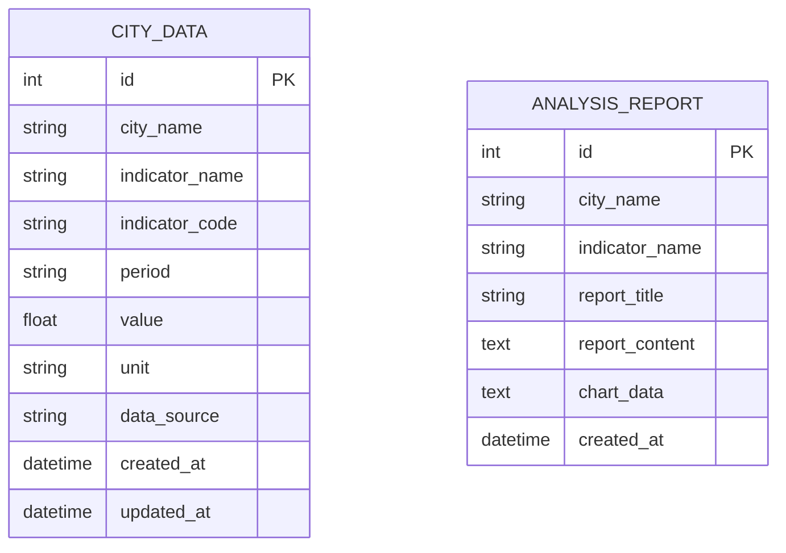

# 屋檐 数据模型设计

本文档描述屋檐项目的核心数据模型、表结构以及数据流转。

---

## ER 图

---

## 表结构说明

### 表一：城市数据表 (city_data)

| 字段名 | 类型 | 说明 |
|---|---|---|
| id | INTEGER PK | 主键，自增 |
| city_name | TEXT | 城市名称 |
| indicator_name | TEXT | 指标名称 |
| indicator_code | TEXT | 指标代码 |
| period | TEXT | 数据期间（YYYYMM） |
| value | FLOAT | 数值 |
| unit | TEXT | 单位 |
| data_source | TEXT | 数据来源 |
| created_at | DATETIME | 创建时间 |
| updated_at | DATETIME | 更新时间 |

### 表二：分析报告表 (analysis_reports)

| 字段名 | 类型 | 说明 |
|---|---|---|
| id | INTEGER PK | 主键，自增 |
| city_name | TEXT | 城市名称 |
| indicator_name | TEXT | 指标名称 |
| report_title | TEXT | 报告标题 |
| report_content | TEXT | 报告内容（Markdown） |
| chart_data | TEXT | 图表数据（JSON） |
| created_at | DATETIME | 创建时间 |

---

## 数据流转

---

## 数据统计

| 数据项 | 数量 | 说明 |
|---|---|---|
| 支持城市 | 10+ | 北京、上海、广州、深圳等 |
| 住房指标 | 9+ | 房价、销售面积、投资额等 |
| 数据期间 | 月度 | 2023年至今 |

---

## 相关文档

- [设计总览](index.md)
- [API 接口说明](api-overview.md)
- [页面设计](pages/index.md)
