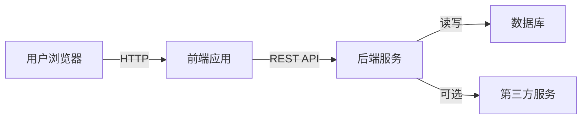
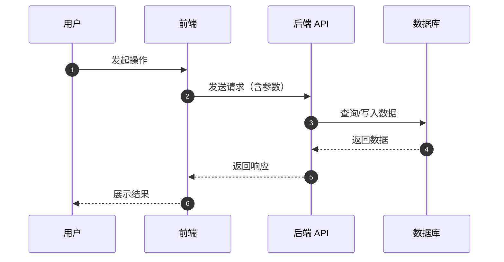
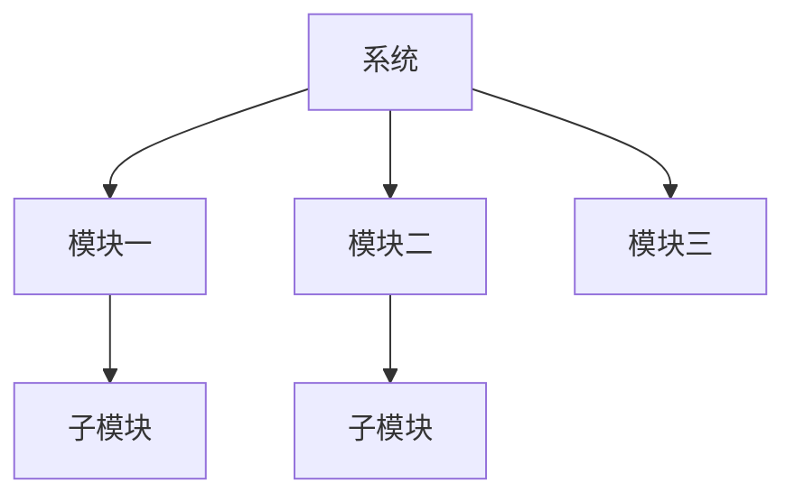

# [项目名称] 系统设计总览

本文档描述 [项目名称] 的整体技术架构、技术栈选型以及前后端交互流程。

---

## 系统架构图

---

## 技术栈

| 层级 | 技术 | 用途 |
|---|---|---|
| 前端 | [框架/库名称] | 用户界面与交互 |
| 后端 | [框架/语言名称] | 业务逻辑与接口服务 |
| 数据库 | [数据库名称] | 数据持久化 |
| 搜索 | [搜索方案名称] | 全文检索（如需要） |
| 部署 | [部署平台名称] | 应用发布与托管 |

---

## 前后端交互流程

---

## 核心设计决策

### 为什么用 [技术 A] 而不是 [技术 B]？

[解释选型原因、权衡点和当前阶段的适用性。]

### 为什么选择 [架构模式]？

[解释架构模式选择的背景和影响。]

---

## 模块划分

---

## 相关文档

- [数据模型](data-model.md)
- [API 接口说明](api-overview.md)
- [页面设计](pages/index.md)
- [决策记录](../decisions/index.md)
- [产品总览](../product/index.md)
