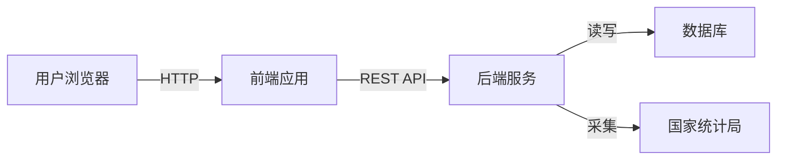
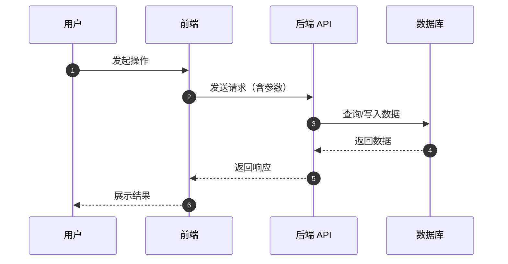
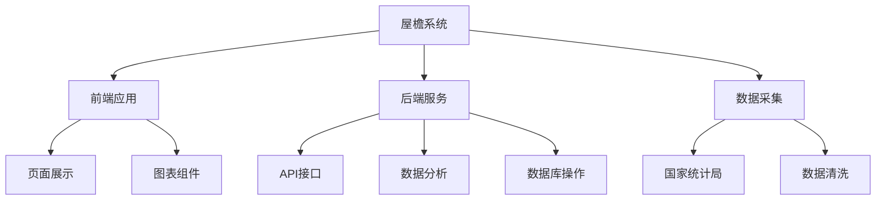

# 屋檐 系统设计总览

本文档描述屋檐项目的整体技术架构、技术栈选型以及前后端交互流程。

---

## 系统架构图

---

## 技术栈

| 层级 | 技术 | 用途 |
|---|---|---|
| 前端 | React 18 + TypeScript + Vite | 用户界面与交互 |
| 后端 | Python + FastAPI | 业务逻辑与接口服务 |
| 数据库 | SQLite + SQLAlchemy | 数据持久化与ORM |
| 采集 | Python requests | 数据采集（规划中） |
| 部署 | 待定 | 应用发布与托管 |

---

## 前后端交互流程

---

## 核心设计决策

### 为什么用 FastAPI 而不是 Flask/Django？

- FastAPI 原生支持异步，性能更好
- 自动 API 文档生成（Swagger UI），便于前后端协作
- 内置数据验证（Pydantic），减少样板代码
- 当前阶段轻量够用，后续可扩展

### 为什么用 React + TypeScript？

- TypeScript 提供类型安全，减少运行时错误
- React 生态成熟，组件化开发效率高
- Vite 构建速度快，开发体验好

### 为什么用 SQLite？

- MVP 阶段数据量小，SQLite 足够使用
- 零配置，部署简单
- 后续可平滑迁移到 PostgreSQL/MySQL

---

## 模块划分

---

## 相关文档

- [数据模型](data-model.md)
- [API 接口说明](api-overview.md)
- [页面设计](pages/index.md)
- [决策记录](../decisions/index.md)
- [产品总览](../product/index.md)
