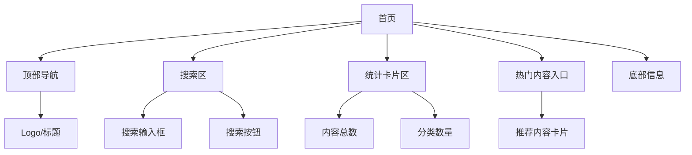

# 首页设计

---

## 页面概述

首页是用户进入 [项目名称] 后的第一个页面，用于展示平台核心数据、提供搜索入口，并引导用户发现内容。

---

## 页面结构

---

## 区域详解

### 1. 顶部导航

- 左侧展示产品 Logo 和名称。
- 右侧可放置个人中心、收藏等入口（如需要）。

### 2. 搜索区

- 居中展示大字号搜索框。
- 用户输入关键词后按回车或点击搜索按钮，跳转至搜索页。
- 空关键词时也允许进入搜索页，展示默认推荐列表。

### 3. 统计卡片区

- 以卡片形式展示平台核心数据，例如：
  - 内容总数
  - 分类数量
  - 其他关键指标

### 4. 热门内容入口

- 展示若干条热门或精选内容。
- 点击后进入对应详情页。

### 5. 底部信息

- 展示版权信息、数据来源说明或相关链接。

---

## 交互说明

| 用户操作 | 系统响应 |
|---|---|
| 在搜索框输入关键词并回车 | 跳转至搜索页，携带关键词参数 |
| 点击搜索按钮 | 同上 |
| 点击热门内容卡片 | 跳转至内容详情页 |
| 点击 Logo | 刷新首页 |

---

## 依赖接口

- `GET /api/stats` —— 获取首页统计数据
- `GET /api/items?limit=...` —— 获取热门/推荐内容
- `GET /api/search?q=...` —— 搜索结果（跳转后使用）

---

## 相关文档

- [页面总览](index.md)
- [搜索页设计](template-page.md)
- [需求 REQ-001：首页浏览与搜索](../../requirements/example-REQ-001.md)
- [API 接口说明](../api-overview.md)
