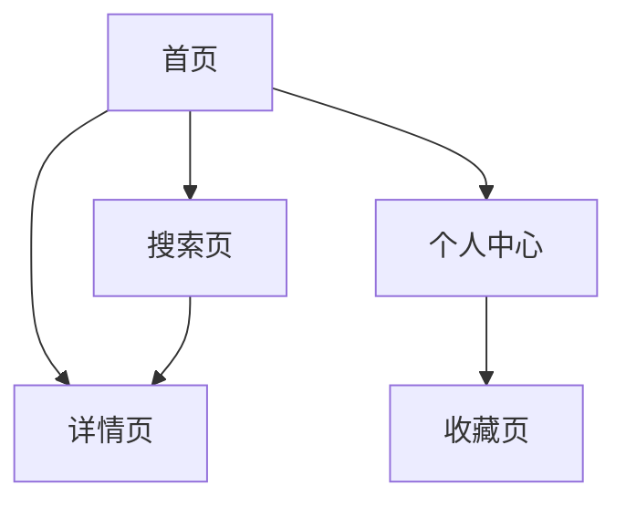
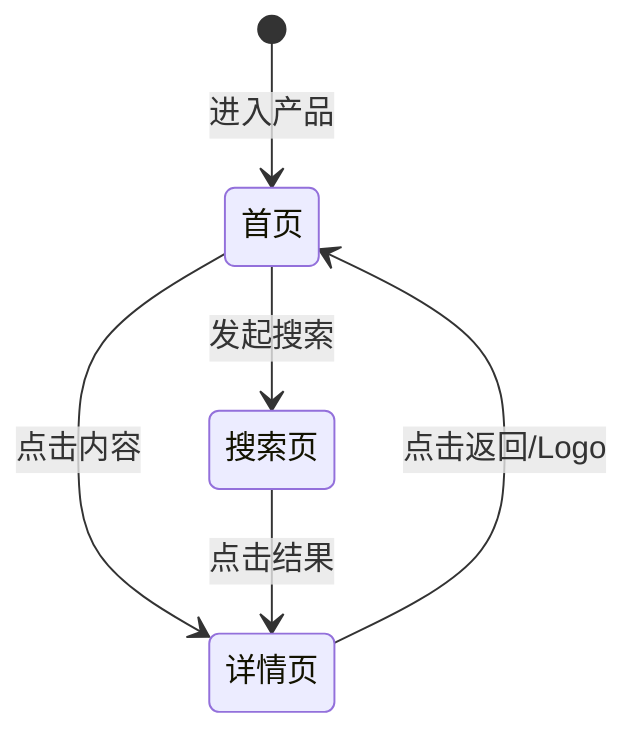

# [项目名称] 页面总览

本文档汇总产品中的所有页面、页面间关系以及共享组件。

---

## 站点地图

---

## 页面清单

| 页面 | 对应文件 | 说明 | 入口方式 |
|---|---|---|---|
| 首页 | `pages/example-home.md` | 平台入口，展示统计与搜索 | 默认进入 |
| 搜索页 | `pages/template-page.md` | 搜索结果展示 | 首页搜索 |
| 详情页 | `pages/template-page.md` | 单条内容详情 | 搜索结果/首页入口 |

---

## 页面状态流转

---

## 共享组件

| 组件 | 用途 | 使用页面 |
|---|---|---|
| [组件 A] | [用途说明] | 首页、搜索页 |
| [组件 B] | [用途说明] | 详情页 |

---

## 相关文档

- [设计总览](../index.md)
- [API 接口说明](../api-overview.md)
- [首页设计](example-home.md)
- [通用页面模板](template-page.md)
