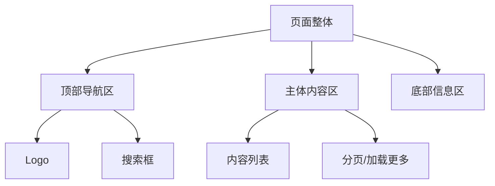

# [页面名称] 设计

---

## 页面概述

[一句话说明这个页面的作用、用户目标和主要场景。]

---

## 页面结构

---

## 区域详解

### 1. 顶部导航区

- 展示 Logo 和页面标题。
- 提供返回上一页或回到首页的入口。

### 2. 主体内容区

- [区域说明，分点描述]
- [数据如何加载、如何展示]
- [空态、加载态、错误态如何处理]

### 3. 底部信息区

- [底部内容说明]

---

## 交互说明

| 用户操作 | 系统响应 |
|---|---|
| 点击某条内容 | 跳转至详情页 |
| 输入关键词并搜索 | 刷新列表为搜索结果 |
| 滚动到底部 | 加载更多内容 |

---

## 依赖接口

- `GET /api/items` —— 获取内容列表
- `GET /api/search` —— 搜索内容
- `GET /api/items/:id` —— 获取内容详情（如需）

---

## 相关文档

- [页面总览](index.md)
- [API 接口说明](../api-overview.md)
- [数据模型](../data-model.md)
