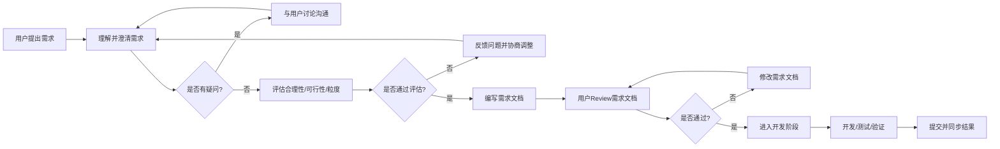

# 屋檐 需求协作与开发流程规范

本文档记录屋檐项目长期有效的需求协作模式，所有需求均应遵循此流程。

---

## 流程总览

---

## 流程说明

### 第一步：理解需求

当用户提出新需求时，我会：

1. **复述需求**：用自己的话复述一遍，确认理解无误。
2. **澄清背景**：了解需求背后的目标、使用场景、优先级。
3. **识别边界**：明确需求范围、排除项、预期效果。

### 第二步：评估需求

在澄清后，我会评估：

| 评估维度 | 说明 |
|---|---|
| **合理性** | 是否符合产品定位和用户价值？是否解决真实问题？ |
| **可实现性** | 当前技术栈、数据、资源是否支持实现？ |
| **粒度** | 需求是否足够细，可以进入开发？是否过大需要拆分？ |

如果任何维度存在问题，我会主动提出并与用户讨论，而不是直接开始开发。

### 第三步：讨论沟通（如需要）

当存在以下情况时，必须暂停并沟通：

- 需求描述模糊，有多个理解方向
- 需求范围过大，建议拆分为多个小需求
- 技术实现存在明显障碍或替代方案
- 与现有功能/规划存在冲突
- 缺少必要信息（如数据源、页面样式、业务规则等）

沟通方式：

- 使用 `AskUserQuestion` 工具给出清晰选项或开放性问题
- 必要时列出 2-4 个方案供用户选择
- 不假设、不猜测，确认后再继续

### 第四步：编写需求文档

需求确认后，按 [需求模板](../requirements/template-requirement.md) 编写 REQ 文档：

1. 分配递增的需求编号（如 REQ-003）。
2. 填写基础信息、背景目标、需求描述、验收标准。
3. 在 [需求看板](../requirements/index.md) 中登记状态。
4. 关联相关产品/设计文档。

### 第五步：用户Review需求文档

编写完成后，我会：

- 通过 `NotifyUser` 工具通知用户Review需求文档
- 明确说明需要用户确认的内容
- 等待用户反馈，不直接进入开发

用户Review通过后，才会进入开发阶段。

### 第六步：开发与交付

开发过程中：

1. 使用 `TodoWrite` 拆解开发任务
2. 优先读取已有代码，理解后再修改
3. 避免过度设计，只实现需求范围内功能
4. 完成后验证并更新相关文档
5. 提交 Git 并同步结果

---

## 特殊情况处理

### 紧急Bug修复

对于线上问题或阻塞性Bug，可简化流程：

- 快速确认问题现象和影响范围
- 直接修复
- 事后补充简要记录

### 微小调整

对于明确的微小调整（如改文案、调参数），可跳过完整需求文档，但应在变更日志或对应文档中记录。

---

## 相关文档

- [需求看板](../requirements/index.md)
- [需求模板](../requirements/template-requirement.md)
- [产品路线图](roadmap.md)
- [变更日志](changelog.md)
