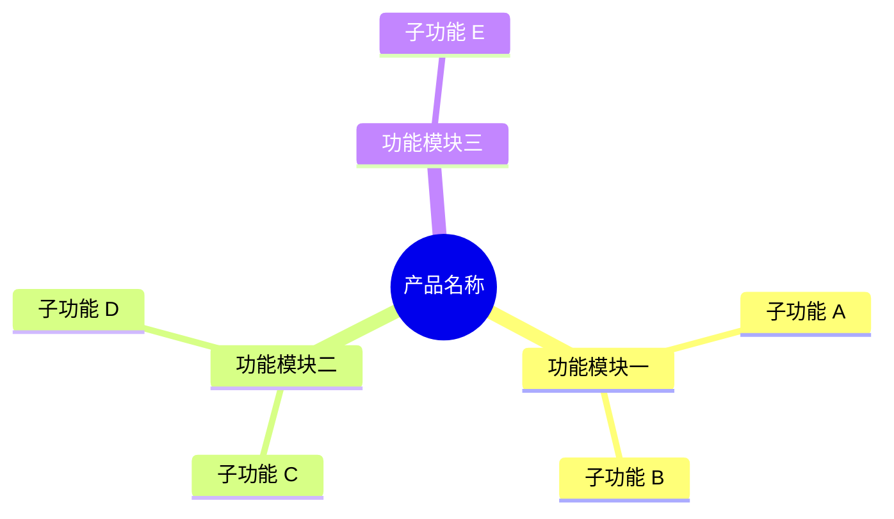
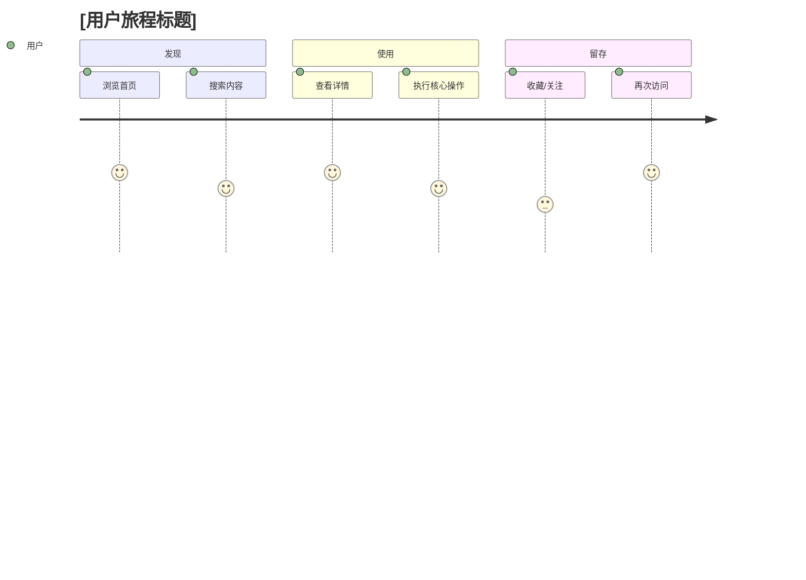

# [项目名称] 产品总览

[一句话描述产品定位：解决什么问题、面向谁、提供什么核心价值。]

---

## 产品定位

[用 2-3 段话说明：]

- 目标用户是谁？
- 他们当前的痛点是什么？
- 本产品如何帮助他们？
- 与竞品或替代方案相比，核心差异点是什么？

---

## 核心功能全景图

---

## 功能模块

### 模块一：[模块一名称]

| 功能 | 说明 | 状态 |
|---|---|---|
| 功能 A | [一句话说明] | ✅ 已上线 |
| 功能 B | [一句话说明] | 🚧 开发中 |
| 功能 C | [一句话说明] | 📋 规划中 |

### 模块二：[模块二名称]

| 功能 | 说明 | 状态 |
|---|---|---|
| 功能 D | [一句话说明] | ✅ 已上线 |
| 功能 E | [一句话说明] | 📋 规划中 |

---

## 用户旅程

---

## 数据来源 / 依赖

| 来源 | 说明 | 链接 |
|---|---|---|
| [数据来源 A] | [说明] | [链接] |
| [第三方服务 B] | [说明] | [链接] |

---

## 相关文档

- [产品路线图](roadmap.md)
- [变更日志](changelog.md)
- [需求看板](../requirements/index.md)
- [系统架构](../design/index.md)
