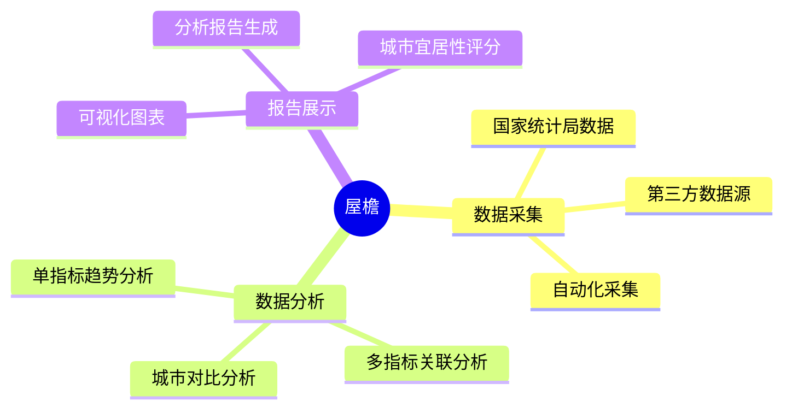
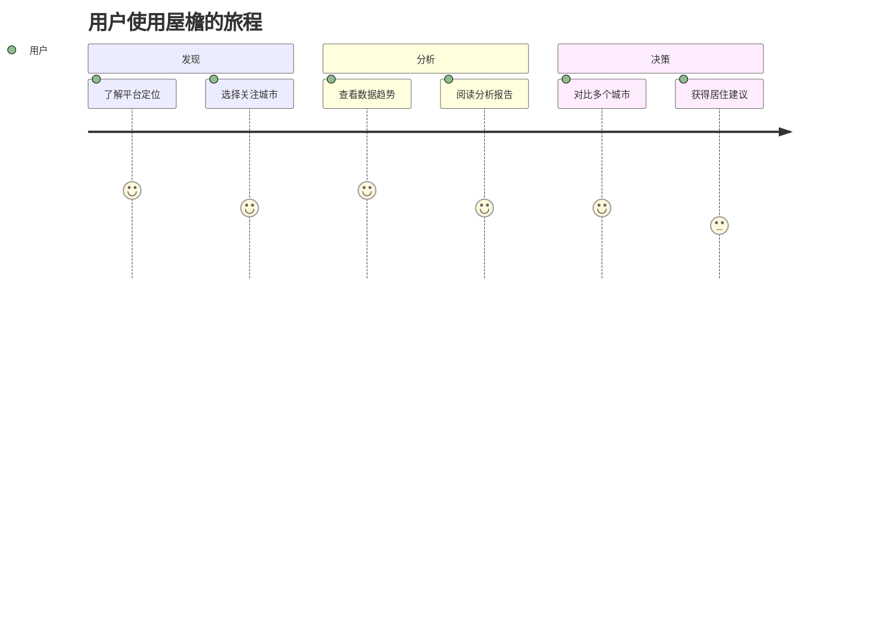

# 屋檐 —— 城市住房数据分析平台

> 愿景：希望每个人都有自己的屋檐，庇护生活。

---

## 产品定位

### 目标用户

- 计划购房或租房的都市人群
- 关注城市居住成本与生活质量的职场人士
- 房产投资者与研究机构

### 当前痛点

1. 城市住房数据分散，难以获取系统性信息
2. 房价、宜居性等维度缺乏综合分析视角
3. 个人难以判断某个城市是否适合自己居住

### 产品如何帮助

屋檐通过整合国家统计局等多源数据，提供：
- 城市房价趋势分析
- 宜居性多维度评估
- 可视化报告与对比工具

帮助用户做出更理性的居住决策。

### 核心差异点

- **数据驱动**：基于真实官方数据，非主观评价
- **多维分析**：不仅看房价，还看收入比、生活成本、环境等
- **渐进深入**：从单城市单指标到多城市综合对比

---

## 核心功能全景图

---

## 功能模块

### 模块一：数据采集

| 功能 | 说明 | 状态 |
|---|---|---|
| 国家统计局数据接入 | 主要城市月度住房相关数据 | 📋 规划中 |
| 多数据源扩展 | 拓展更多维度数据源 | 📋 规划中 |
| 自动化采集 | 定时自动采集与更新 | 📋 规划中 |

### 模块二：数据分析

| 功能 | 说明 | 状态 |
|---|---|---|
| 单指标分析 | 某城市某项数据的趋势分析 | 📋 规划中 |
| 多指标综合分析 | 多项数据的关联分析 | 📋 规划中 |
| 城市对比 | 多个城市同维度对比 | 📋 规划中 |

### 模块三：报告展示

| 功能 | 说明 | 状态 |
|---|---|---|
| 可视化图表 | 折线图、柱状图等数据展示 | 📋 规划中 |
| 分析报告生成 | 自动生成文字分析报告 | 📋 规划中 |
| 宜居性评分 | 综合多维度给出城市评分 | 📋 规划中 |

---

## 用户旅程

---

## 数据来源 / 依赖

| 来源 | 说明 | 链接 |
|---|---|---|
| 国家统计局 | 主要城市月度住房数据 | https://data.stats.gov.cn |

---

## 相关文档

- [产品路线图](roadmap.md)
- [变更日志](changelog.md)
- [需求看板](../requirements/index.md)
- [系统架构](../design/index.md)
