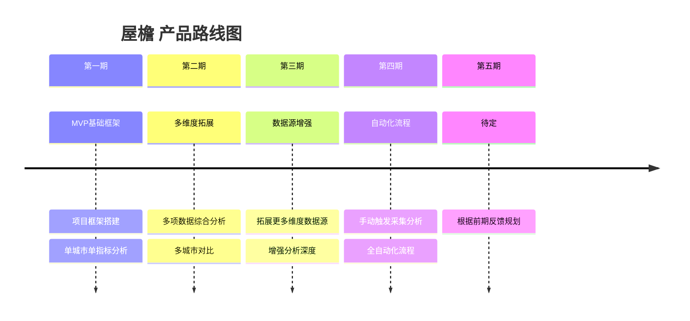

# 屋檐 产品路线图

本文档记录产品的长期规划与阶段性目标。

---

## 产品路线图



---

## 已完成功能

| 阶段 | 时间 | 主要内容 | 关联需求 |
|---|---|---|---|
| Phase 1 | 2026-06-22 | 项目基础框架搭建（后端FastAPI + 前端React + 数据库） | REQ-001 |

---

## 规划中功能

| 优先级 | 功能 | 说明 | 预期阶段 |
|---|---|---|---|
| 🔴 P0 | 国家统计局数据采集 | 接入主要城市月度住房数据 | Phase 1 |
| 🔴 P0 | 单指标分析报告 | 某城市某项数据的趋势分析与可视化 | Phase 1 |
| 🟡 P1 | 多指标综合分析 | 多项数据的关联分析 | Phase 2 |
| 🟡 P1 | 城市对比功能 | 多个城市同维度对比分析 | Phase 2 |
| 🟢 P2 | 多数据源接入 | 拓展更多维度数据源 | Phase 3 |
| 🟢 P2 | 自动化采集流程 | 定时自动采集与更新 | Phase 4 |

---

## 需求状态看板

```mermaid
kanban
  title 需求状态看板
  待梳理
    [REQ-002] 数据采集模块
  已确认
  开发中
  待验收
  已完成
    [REQ-001] 项目基础框架搭建
```

---

## 相关文档

- [产品总览](index.md)
- [变更日志](changelog.md)
- [需求看板](../requirements/index.md)
