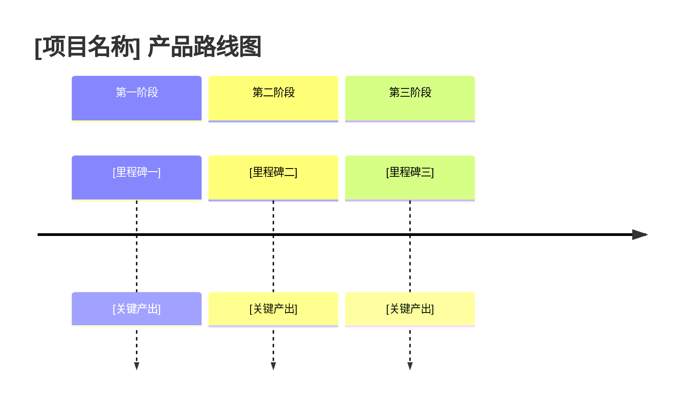
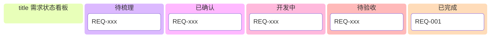

# [项目名称] 产品路线图

本文档记录产品的长期规划与阶段性目标。

---

## 产品路线图

---

## 已完成功能

| 阶段 | 时间 | 主要内容 | 关联需求 |
|---|---|---|---|
| Phase 1 | YYYY-MM-DD | [描述该阶段上线功能] | REQ-001 |
| Phase 2 | YYYY-MM-DD | [描述该阶段上线功能] | REQ-002 |

---

## 规划中功能

| 优先级 | 功能 | 说明 | 预期阶段 |
|---|---|---|---|
| 🔴 P0 | [功能 A] | [说明] | Phase 3 |
| 🟡 P1 | [功能 B] | [说明] | Phase 4 |
| 🟢 P2 | [功能 C] | [说明] | Phase 5 |

---

## 需求状态看板

---

## 相关文档

- [产品总览](index.md)
- [变更日志](changelog.md)
- [需求看板](../requirements/index.md)
