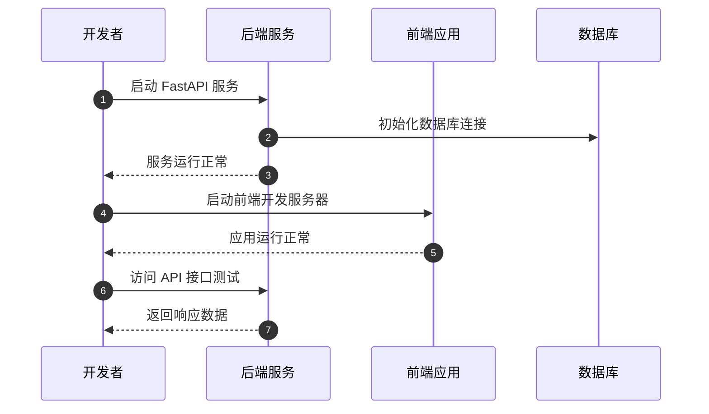

# REQ-001 —— 项目基础框架搭建

---

## 基础信息

| 字段 | 内容 |
|---|---|
| **需求编号** | REQ-001 |
| **需求名称** | 项目基础框架搭建 |
| **提出时间** | 2026-06-22 |
| **提出人** | hhyouyou |
| **优先级** | 🔴 P0 |
| **状态** | ✅ 已完成 |
| **关联需求** | 无 |

---

## 背景与目标

### 为什么要做这个需求？

屋檐项目需要从零开始搭建一个可扩展的技术基础，为后续的数据采集、分析和展示功能提供支撑。一个清晰、规范的项目框架是后续开发效率的保障。

### 期望达成什么效果？

1. 建立前后端分离的项目结构
2. 确定技术栈选型并初始化配置
3. 配置数据库连接和ORM框架
4. 按 doc 规范建立项目文档体系

---

## 需求描述

### 功能概述

搭建屋檐项目的完整技术框架，包括后端服务、前端应用、数据库配置和项目文档结构。

### 详细说明

1. **后端框架**
   - 使用 FastAPI 搭建 Python 后端服务
   - 配置 SQLAlchemy ORM 和 SQLite 数据库
   - 设置 CORS 跨域支持
   - 创建基础项目目录结构（app, data, analysis, db）

2. **前端框架**
   - 使用 React 18 + TypeScript + Vite 搭建前端应用
   - 配置开发服务器和 API 代理
   - 创建基础页面组件

3. **数据库**
   - 配置 SQLAlchemy 连接 SQLite
   - 创建基础模型文件（预留扩展）

4. **项目文档**
   - 更新产品总览、路线图、变更日志
   - 按规范创建需求文档

### 用户交互流程

### 页面/界面

- 前端首页：展示项目名称和愿景说明（占位页面）

---

## 验收标准

- [x] 后端 FastAPI 服务可正常启动
- [x] 前端 React 应用可正常启动
- [x] 数据库配置完成，ORM 可正常连接
- [x] 前后端目录结构符合规范
- [x] 项目文档按 doc 规范初始化
- [x] 代码已提交到 GitHub 仓库

---

## 备注

- 此为项目初始化需求，不包含具体业务功能实现
- 后续数据采集和分析功能将在后续需求中实现
- 技术栈选型基于轻量、易扩展原则

---

## 需求流转记录

| 时间 | 操作人 | 状态变更 | 说明 |
|---|---|---|---|
| 2026-06-22 | hhyouyou | 待梳理 | 首次提出，明确项目框架搭建需求 |
| 2026-06-22 | hhyouyou | 已确认 | 技术方案确认：FastAPI + React + SQLite |
| 2026-06-22 | hhyouyou | 开发中 | 开始搭建项目框架 |
| 2026-06-22 | hhyouyou | 待验收 | 框架搭建完成，代码已推送 GitHub |
| 2026-06-22 | hhyouyou | 已完成 | 验收通过，项目框架可用 |

---

## 相关文档

- [需求看板](index.md)
- [产品路线图](../product/roadmap.md)
- [产品总览](../product/index.md)
- [系统架构](../design/index.md)
