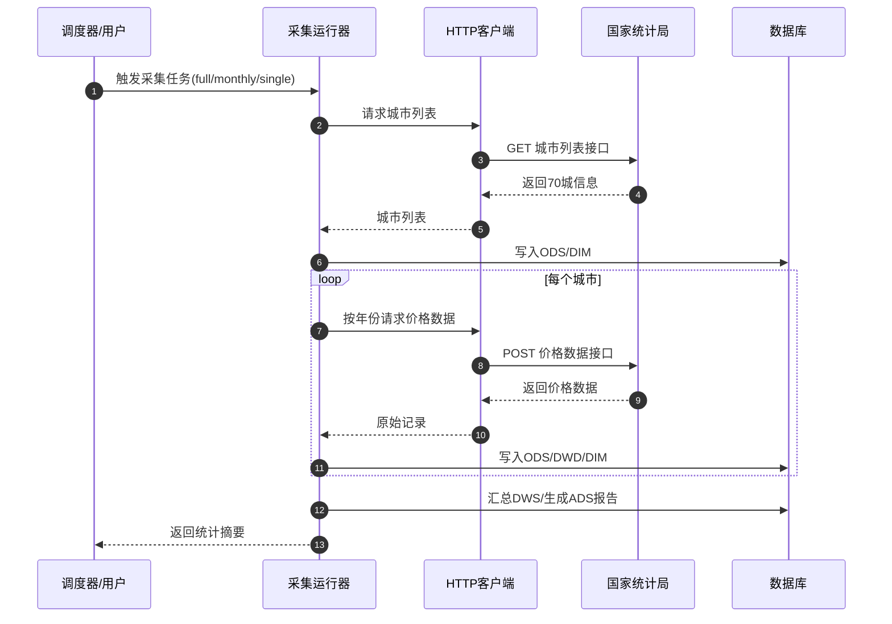

> 复制本文件，重命名为 `REQ-编号-需求名称.md`，然后按下面每个区块填写内容。
> 不懂的字段可以先空着，和开发沟通后再补充。

---

## 基础信息

| 字段 | 内容 |
|---|---|
| **需求编号** | REQ-002 |
| **需求名称** | 国家统计局70城住宅销售价格数据采集 |
| **提出时间** | 2026-06-22 |
| **提出人** | 产品负责人 |
| **优先级** | 🔴 P0 |
| **状态** | 已完成 |
| **关联需求** | REQ-001 |

---

## 背景与目标

### 为什么要做这个需求？

屋檐项目的核心是基于真实数据分析城市住房相关信息。国家统计局发布的70个大中城市住宅销售价格指数是国内最权威的房价数据源之一，包含新建商品住宅和二手住宅的环比、同比、定基等多维度指标。本项目需要接入该数据源，为后续单城市分析、多城市对比、趋势预测等功能提供数据基础。

### 期望达成什么效果？

1. 能够自动从国家统计局采集70个大中城市的住宅销售价格数据。
2. 数据按数仓规范分层存储（ODS/DWD/DIM/DWS/ADS），便于后续分析和展示。
3. 支持历史数据全量初始化和未来每月自动增量更新。
4. 采集过程具备风控策略，避免因频繁请求触发反爬机制。

---

## 需求描述

### 功能概述

开发一个独立的数据采集模块，通过国家统计局两个公开接口获取70个大中城市的住宅销售价格数据，并将原始数据、明细数据、维度数据、汇总数据、应用数据依次写入数据库。模块需支持全量初始化、单城市补采、月度增量更新三种模式，并提供定时任务入口。

### 详细说明

1. **数据源接口**
   - 接口1（GET）：获取70个大中城市列表（城市名称+编码）。
   - 接口2（POST）：获取指定城市指定时间范围的住宅销售价格数据（35个指标）。

2. **采集策略**
   - 每次API调用后随机等待1-5秒。
   - 每个城市采集完成后随机等待3-5分钟，再采集下一个城市。
   - 按年份分段请求数据（每年12个月为一个请求）。

3. **数据仓库分层**
   - ODS层：原始JSON数据落地。
   - DWD层：清洗后的标准明细数据（城市+指标+期间+数值）。
   - DIM层：城市维度、指标维度、时间维度。
   - DWS层：按城市和月份汇总的房价指标、趋势特征。
   - ADS层：面向业务的分析报告、排名、对比数据。

4. **运行模式**
   - `full`：70城全量历史数据初始化（默认跳过已采集的南京）。
   - `single`：单个城市历史数据补采。
   - `monthly`：按月增量更新所有城市最新数据。

5. **定时任务支持**
   - 提供 `scheduler.py` 作为定时任务入口。
   - 推荐每月15日上午10点执行月度增量更新。

### 用户交互流程

### 页面/界面（如有）

本需求为后端数据模块，无前端页面。

---

## 验收标准

- [x] 标准 1：能够从国家统计局成功获取70个城市列表并写入数据库。
- [x] 标准 2：能够按年份分段采集指定城市的住宅销售价格数据。
- [x] 标准 3：数据按ODS/DWD/DIM/DWS/ADS五层规范落库。
- [x] 标准 4：南京市2020年1月至2026年5月共77个月数据完整入库。
- [x] 标准 5：每次API调用间隔1-5秒，城市间间隔3-5分钟。
- [x] 标准 6：模块支持全量初始化、单城市补采、月度增量更新三种模式。
- [x] 标准 7：提供定时任务入口 `scheduler.py` 供后续自动化调用。
- [x] 标准 8：模块README文档完整，说明使用方式和风控策略。

---

## 备注

- 国家统计局接口参数（如 `indicatorIds`、`cid`、`rootId`）目前为固定值，若接口结构变化需要同步调整 `config.py`。
- 70城全量初始化（2020-2025年，每年12个月，每城市6次请求）总请求量约为70×6=420次价格接口请求，按风控策略预计耗时约21-35小时，建议在低峰期执行。
- 月度增量更新每次请求1个月，70城约70次请求，按风控策略预计耗时约3.5-6小时。

---

## 需求流转记录

| 时间 | 操作人 | 状态变更 | 说明 |
|---|---|---|---|
| 2026-06-22 | 产品经理 | 待梳理 | 首次提出 |
| 2026-06-22 | 开发 | 已确认 | 明确数据源接口和数仓分层方案 |
| 2026-06-22 | 开发 | 开发中 | 开始实现数据采集模块 |
| 2026-06-22 | 开发 | 已完成 | 完成南京市数据初始化与模块重构 |

---

## 相关文档

- [需求看板](index.md)
- [产品路线图](../product/roadmap.md)
- [产品总览](../product/index.md)
- [API接口说明](../design/api-overview.md)
- [数据模型设计](../design/data-model.md)
- [数据采集模块README](../../../backend/data_collection/README.md)
