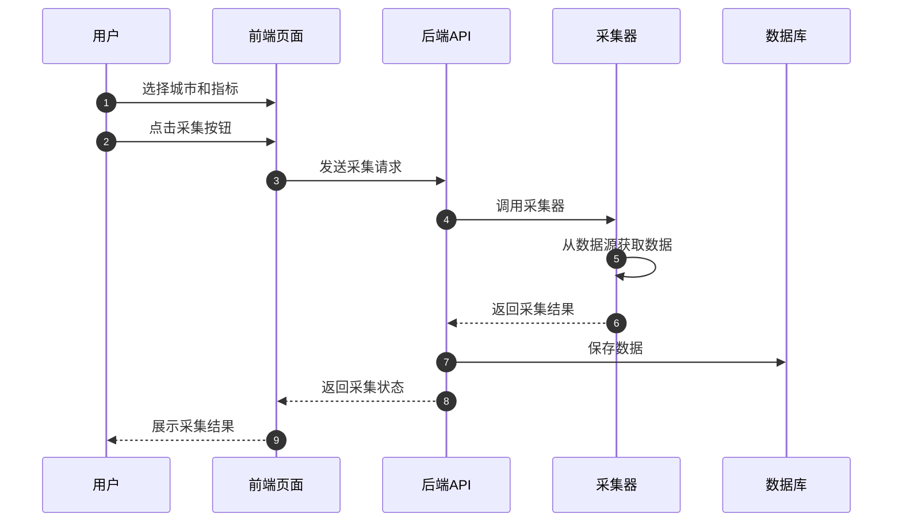

# REQ-002 —— 数据采集模块

---

## 基础信息

| 字段 | 内容 |
|---|---|
| **需求编号** | REQ-002 |
| **需求名称** | 数据采集模块 |
| **提出时间** | 2026-06-22 |
| **提出人** | hhyouyou |
| **优先级** | 🔴 P0 |
| **状态** | 待梳理 |
| **关联需求** | REQ-001 |

---

## 背景与目标

### 为什么要做这个需求？

屋檐项目的核心价值是基于真实数据分析城市住房信息，因此需要建立稳定可靠的数据采集能力，从国家统计局等权威数据源获取数据。

### 期望达成什么效果？

1. 能够采集国家统计局主要城市的月度住房相关数据
2. 数据能够持久化存储到本地数据库
3. 采集过程可手动触发，为后续自动化做准备

---

## 需求描述

### 功能概述

实现数据采集模块，支持从国家统计局获取主要城市的住房相关月度数据，并保存到数据库中。

### 详细说明

1. **数据源配置**
   - 支持国家统计局主要城市数据
   - 配置城市列表和指标列表
   - 支持时间范围选择

2. **数据采集**
   - 手动触发数据采集
   - 支持单城市单指标采集
   - 数据清洗和格式化

3. **数据存储**
   - 将采集的数据保存到 SQLite 数据库
   - 支持数据去重和更新

### 用户交互流程

### 页面/界面

- 数据采集页面：城市选择器、指标选择器、时间范围选择、采集按钮

---

## 验收标准

- [ ] 支持至少10个主要城市的数据采集
- [ ] 支持住房相关核心指标（房价、销售面积等）
- [ ] 采集的数据能够正确保存到数据库
- [ ] 支持查看采集历史记录
- [ ] 采集过程有错误处理和日志记录

---

## 备注

- MVP阶段先支持手动触发采集
- 数据采集方案由用户后续提供具体实现
- 需要考虑数据源的稳定性和反爬策略

---

## 需求流转记录

| 时间 | 操作人 | 状态变更 | 说明 |
|---|---|---|---|
| 2026-06-22 | hhyouyou | 待梳理 | 首次提出，待进一步细化数据采集方案 |

---

## 相关文档

- [需求看板](index.md)
- [产品路线图](../product/roadmap.md)
- [产品总览](../product/index.md)
