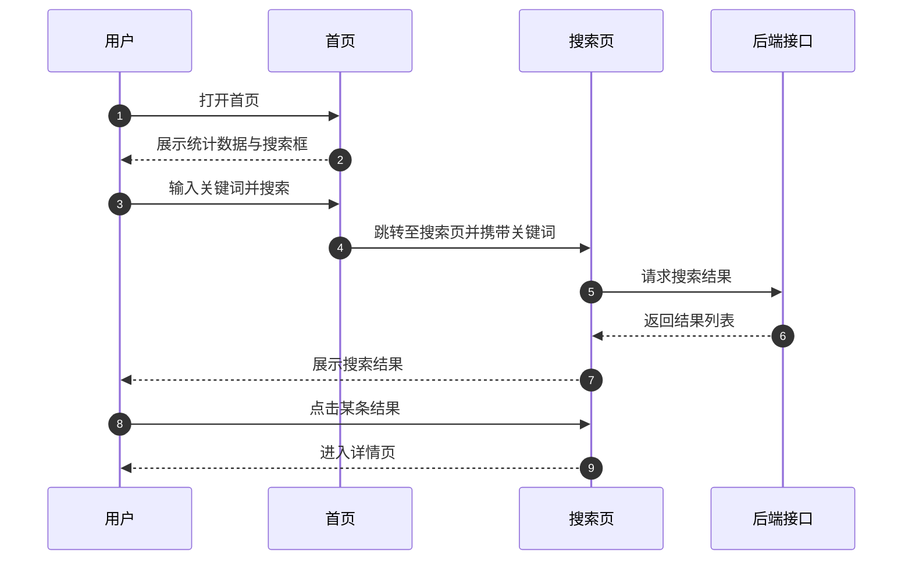

# REQ-001 —— 首页浏览与搜索

---

## 基础信息

| 字段 | 内容 |
|---|---|
| **需求编号** | REQ-001 |
| **需求名称** | 首页浏览与搜索 |
| **提出时间** | YYYY-MM-DD |
| **提出人** | 产品经理 |
| **优先级** | 🔴 P0 |
| **状态** | ✅ 已完成 |
| **关联需求** | 无 |

---

## 背景与目标

### 为什么要做这个需求？

用户进入产品后，需要快速了解平台提供的内容，并能够通过搜索找到感兴趣的信息。当前缺少一个统一的首页入口和搜索能力。

### 期望达成什么效果？

1. 首页展示平台核心数据，帮助用户建立第一印象。
2. 用户可以通过关键词搜索到目标内容。
3. 搜索结果支持点击进入详情页。

---

## 需求描述

### 功能概述

在首页展示平台统计信息、热门内容入口和搜索框；用户输入关键词后跳转到搜索结果页。

### 详细说明

1. 首页顶部展示平台名称和搜索框。
2. 首页主体展示统计卡片（如内容总数、分类数量等）。
3. 首页展示若干热门内容入口或推荐模块。
4. 用户在搜索框输入关键词后，按回车或点击搜索按钮进入搜索页。
5. 搜索页展示与关键词相关的结果列表，支持点击进入详情页。
6. 空搜索词时，搜索页展示默认推荐列表。

### 用户交互流程

### 页面/界面

- 首页：顶部标题 + 搜索框 + 统计卡片 + 热门入口。
- 搜索页：顶部搜索框 + 结果列表 + 空态提示。

---

## 验收标准

- [x] 首页正常展示平台统计数据
- [x] 搜索支持关键词，返回相关结果
- [x] 空关键词时展示默认推荐列表
- [x] 点击结果可进入详情页
- [x] 搜索结果为空时给出友好提示

---

## 备注

- 搜索功能需要考虑中文分词或拼音匹配（视项目需求而定）。
- 后续可扩展高级筛选、搜索历史等功能。

---

## 需求流转记录

| 时间 | 操作人 | 状态变更 | 说明 |
|---|---|---|---|
| YYYY-MM-DD | 产品经理 | 待梳理 | 首次提出 |
| YYYY-MM-DD | 开发 | 已确认 | 技术方案确认，无风险 |
| YYYY-MM-DD | 开发 | 开发中 | 开始 MVP 开发 |
| YYYY-MM-DD | 开发 | 待验收 | 功能开发完成 |
| YYYY-MM-DD | 产品经理 | 已完成 | 验收通过，Phase 1 上线 |

---

## 相关文档

- [需求看板](index.md)
- [产品路线图](../product/roadmap.md)
- [首页页面设计](../design/pages/example-home.md)
- [API 接口说明](../design/api-overview.md)
