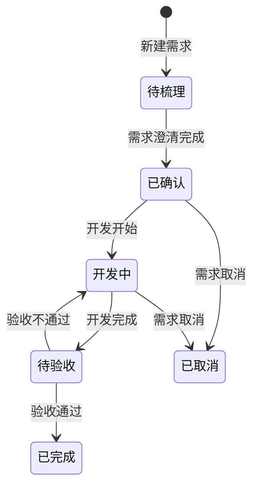
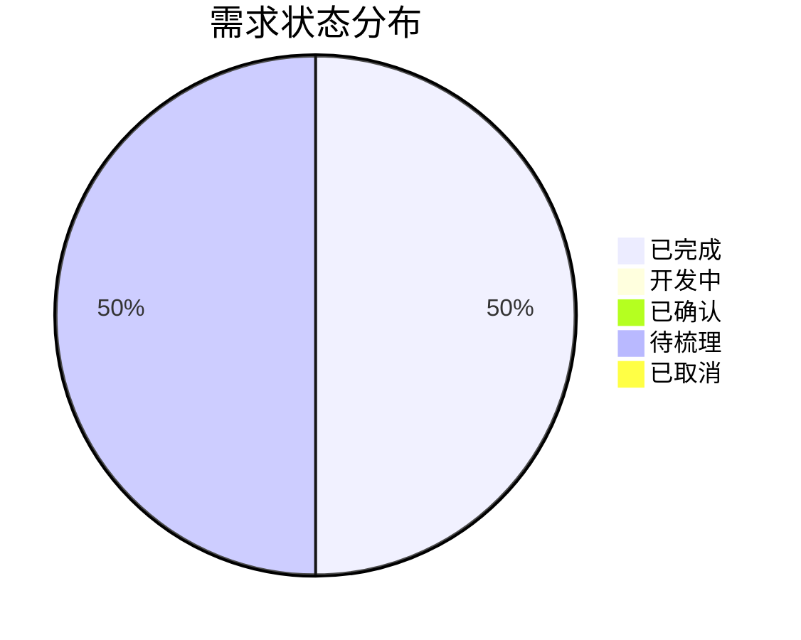

# 屋檐 需求看板

本文档汇总所有需求与 Bug 的状态，是产品进度的统一入口。

---

## 需求状态流转图

---

## 需求列表

### 已完成

| 编号 | 需求名称 | 提出时间 | 完成时间 | 文档 |
|---|---|---|---|---|
| REQ-001 | 项目基础框架搭建 | 2026-06-22 | 2026-06-22 | [REQ-001-项目基础框架搭建.md](REQ-001-项目基础框架搭建.md) |

### 开发中

| 编号 | 需求名称 | 提出时间 | 预计完成 | 文档 |
|---|---|---|---|---|
| 无 |  |  |  |  |

### 已确认（待开发）

| 编号 | 需求名称 | 提出时间 | 优先级 | 文档 |
|---|---|---|---|---|
| 无 |  |  |  |  |

### 待梳理

| 编号 | 需求名称 | 提出时间 | 来源 | 文档 |
|---|---|---|---|---|
| REQ-002 | 数据采集模块 | 2026-06-22 | 产品规划 | [REQ-002-数据采集模块.md](REQ-002-数据采集模块.md) |

### 已取消

| 编号 | 需求名称 | 取消时间 | 原因 | 文档 |
|---|---|---|---|---|
| 无 |  |  |  |  |

---

## Bug 修复中

| 编号 | Bug 描述 | 发现时间 | 优先级 | 文档 |
|---|---|---|---|---|
| 无 |  |  |  |  |

## Bug 已修复

| 编号 | Bug 描述 | 修复时间 | 关联需求 | 文档 |
|---|---|---|---|---|
| 无 |  |  |  |  |

---

## 需求统计

---

## 如何提新需求

1. 复制 [template-requirement.md](template-requirement.md)。
2. 重命名为 `REQ-编号-需求名称.md`。
3. 按模板填写内容。
4. 在本文件对应状态列表中登记。

## 如何提 Bug

1. 复制 [template-bug.md](template-bug.md)。
2. 重命名为 `BUG-编号-问题描述.md`。
3. 按模板填写内容。
4. 在本文件 Bug 列表中登记。

---

## 相关文档

- [产品总览](../product/index.md)
- [产品路线图](../product/roadmap.md)
- [变更日志](../product/changelog.md)
- [需求模板](template-requirement.md)
- [Bug 模板](template-bug.md)
