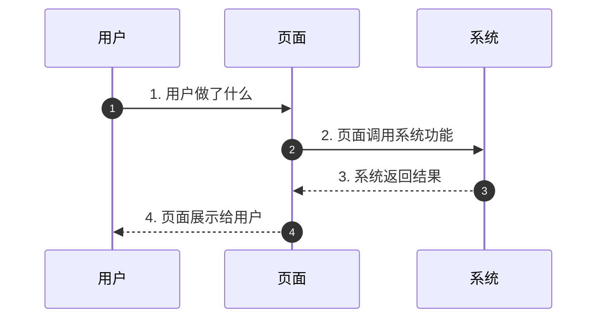

# REQ-xxx —— 【请替换为你的需求名称】

> 复制本文件，重命名为 `REQ-编号-需求名称.md`，然后按下面每个区块填写内容。
> 不懂的字段可以先空着，和开发沟通后再补充。

---

## 基础信息

| 字段 | 内容 |
|---|---|
| **需求编号** | REQ-xxx（按顺序编号，如 REQ-003） |
| **需求名称** | （一句话描述这个需求） |
| **提出时间** | YYYY-MM-DD |
| **提出人** | （你的名字或角色） |
| **优先级** | 🔴 P0（紧急）/ 🟡 P1（重要）/ 🟢 P2（一般） |
| **状态** | 待梳理 |
| **关联需求** | （如果有依赖的其他需求，写在这里） |

---

## 背景与目标

### 为什么要做这个需求？

（描述当前的问题或用户的痛点。比如：用户反馈找不到、体验不好、竞品有但我们没有……）

### 期望达成什么效果？

（做完之后，用户能做什么之前做不到的事？或者体验会有什么提升？）

---

## 需求描述

### 功能概述

（用通俗易懂的话描述这个功能是什么。比如：在首页加一个按钮，点击后随机展示一条内容。）

### 详细说明

（逐条列出具体要做什么，越详细越好。）

1. xxx
2. xxx
3. xxx

### 用户交互流程

（描述用户怎么使用这个功能，一步一步来。）

### 页面/界面（如有）

（如果有界面改动，用文字描述大概长什么样，或者附一张草图/截图。）

---

## 验收标准

（怎么判断这个功能做完了、做对了？逐条列出可验证的标准。）

- [ ] 标准 1：用户可以做 xxx
- [ ] 标准 2：页面展示 xxx
- [ ] 标准 3：数据正确性验证 xxx
- [ ] 标准 4：异常情况处理 xxx

---

## 备注

（任何补充信息：参考竞品、特殊考虑、风险点等。）

---

## 需求流转记录

| 时间 | 操作人 | 状态变更 | 说明 |
|---|---|---|---|
| YYYY-MM-DD | 产品经理 | 待梳理 | 首次提出 |
| YYYY-MM-DD | 开发 | 已确认 | 需求澄清完成，无技术障碍 |
| YYYY-MM-DD | 开发 | 开发中 | 开始开发 |
| YYYY-MM-DD | 开发 | 待验收 | 开发完成 |
| YYYY-MM-DD | 产品经理 | 已完成 | 验收通过 |

---

## 相关文档

- [需求看板](index.md)
- [产品路线图](../product/roadmap.md)
- [产品总览](../product/index.md)
